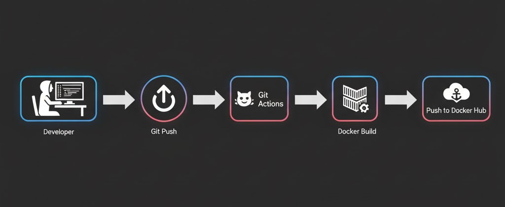

# Project: Cloud Task Manager API with CI/CD
### FINAL PROJECT VERSION: V1 - OCT 19, 2025

This repository contains the **source code** and **CI/CD pipeline** for a secure, **multi-tenant REST API built with Python (FastAPI) and PostgreSQL**.

The project demonstrates a **full backend development lifecycle**, from local containerized development to a fully automated CI pipeline using **GitHub Actions** that builds and publishes a production-ready Docker image to Docker Hub.

The application features **JWT-based authentication, password hashing with Argon2, resource ownership, and follows modern API design principles**. 
The entire system showcases an end-to-end workflow for developing, containerizing, and preparing a 
backend service for deployment.

---

## Core Concepts & Skills Demonstrated

### **Backend API Development**:

- Built a robust and scalable REST API using FastAPI, with full CRUD (Create, Read, Update, Delete) functionality for user and task management. Implemented data validation and serialization using Pydantic schemas.

### **Authentication & Security**:

- Integrated a **secure authentication system using JWT (JSON Web Tokens)** via the standard **OAuth2 Password Flow**. 
- Implemented strong password hashing using Argon2 via the passlib library, a modern and recommended alternative to Bcrypt.

- Enforced resource ownership, ensuring users can only access and modify their own data.

### **Database Management**:

- Utilized **PostgreSQL** as the relational database.
 
- Managed database interactions and schema definitions in a "Pythonic" way using SQLAlchemy ORM.

### **Containerization & CI/CD:**

- **Docker**: Wrote a clean, efficient Dockerfile to containerize the FastAPI application for production.

- **Docker Compose**: Used to orchestrate the local development environment, including the API service and PostgreSQL database.

- **GitHub Actions**: Designed and implemented a complete CI (Continuous Integration) pipeline that automatically builds the Docker image and pushes it to Docker Hub on every commit to the main branch.

- **Advanced Debugging**: Systematically diagnosed and solved complex, real-world issues related to library incompatibilities (bcrypt), Docker networking (No route to host), and Python import resolution within containers (ModuleNotFoundError).

---

## Architecture Diagram



(Note: You'll need to create a simple diagram for this. I recommend a tool like draw.io or Excalidraw. It should show: Developer -> Git Push -> GitHub Actions -> Docker Build -> Push to Docker Hub.)

---

## Project Structure
```code
cloud-task-manager-api/
│
├──.github/workflows
    ├── ci-pipeline.yml
├── app/
    ├── __init__.py
    ├── main.py
    ├── config.py
    └── database.py
    └── models.py
    └── oauth2.py
    └── schemas.py
    └── utils.py
    ├── routers/
        ├── __init__.py
        ├── auth.py
        ├── task.py
        ├── user.py
├── Dockerfile
├── docker-compose.yml
├── requirements.txt
└── README.md
```

---

## How to Run This Project Locally

**Prerequisites**:

- Docker Desktop installed and running.
A code editor like **VS Code**.

### Step 1: Clone the Repository
```bash
git clone https://github.com/YogeshT22/cloud-task-manager-api.git
cd cloud-task-manager-api
```

### Step 2: Configure Environment Variables
- Create a `.env` file in the project root by copying the example:
```Bash
cp .env.example .env
```

- The default values in the .env file are pre-configured to work with the docker-compose.yml setup. You can generate a new SECRET_KEY for better security if you wish.


### Step 3: Launch the Development Environment

- This command will build the necessary images and start the FastAPI application and the PostgreSQL database in detached mode.

```Bash
docker-compose up --build -d
```

- The API will be available at `http://localhost:8000`
- The interactive API documentation (Swagger UI) is available at `http://localhost:8000/docs`. 

_The API is now running. You can use the interactive docs to test the endpoints._

- **Create a User**: Go to `POST /users/` and create a new user with an email and password.
- **Log In**: Go to `POST /login`, enter the same credentials (using the email as the username), and execute to receive a JWT access_token.

    <u>Note: _"Tokens expire automatically, and refresh tokens will be added in a future version of this project for long-lived sessions.”_</u>

- **Authorize**: Click the `"Authorize"` button at the top right of the docs, paste your token (e.g., Bearer eyJhbGci...), and authorize.
- **Create and Manage Tasks**: You can now use the protected `/tasks/` endpoints to _**create, view, update, and delete tasks associated with your user.**_

---

## CI/CD Pipeline

- This repository is configured with a **GitHub Actions workflow** located in `.github/workflows/ci-pipeline.yml`

- **Trigger**: The pipeline runs automatically on every git push to the main branch.

- **Actions**: 
	- Checkout Code: The runner checks out the latest version of the source code.

	- Login to Docker Hub: It authenticates with Docker Hub using secrets stored in the repository settings (DOCKERHUB_USERNAME, DOCKERHUB_TOKEN).
	
	- Build & Push Image: It builds a new Docker image using the Dockerfile and pushes it to the public repository `<your-dockerhub-username>/<repo-name>`, tagging it with latest and the unique Git commit SHA.
	
	- The public Docker image can be pulled using:
	```bash
	docker pull <your-dockerhub-username>/<image-name>:latest
	```
	_example:_ 	`yogesht22/cloud-task-manager-api:latest_`

---

## License

This project is licensed under the MIT License - see the LICENSE file for details.

