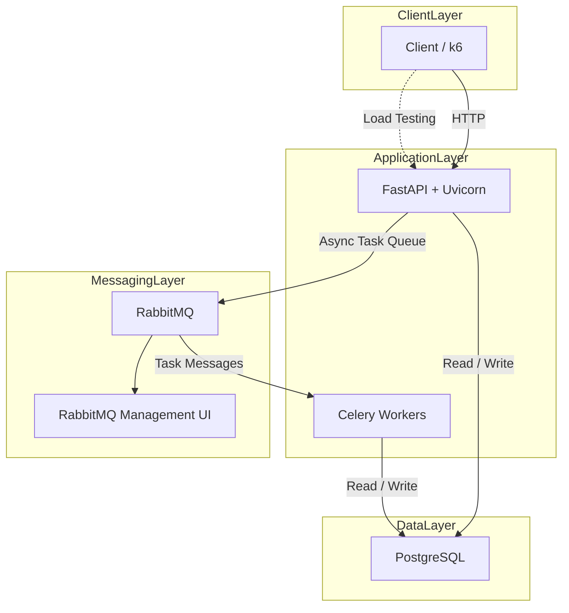

# Distributed Background Jobs with Celery + RabbitMQ

[](LICENSE)
[](https://github.com/YogeshT22/cloud-task-manager-api/actions/workflows/ci-pipeline.yml) 

- This project demonstrates how to implement distributed background task processing in a FastAPI application using Celery and RabbitMQ.

- The API allows users to create tasks and trigger asynchronous reminders, which are processed by Celery workers in the background.

- Personal local POC demo/learning project for distributed task processing patterns. Focuses on reliability, retries, and scalability with Celery and RabbitMQ.

### Overview

This project has been enhanced with **Celery** for distributed background task processing and **RabbitMQ** as the message broker.

This enables:

- **Asynchronous task processing** (send reminders, notifications, scheduled jobs)
- **Automatic retries** with exponential backoff
- **Fault tolerance** - tasks survive worker restarts
- **Horizontal scaling** - multiple workers can process tasks in parallel
- **Task monitoring** - track task status and results

### Quick Start

#### Prerequisites

- Docker & Docker Compose
- Make (optional, for simplified commands)

#### Run the Stack

Using Makefile (fastest):

```bash
make bootstrap
```

###

Or with Docker Compose directly:

```bash
docker-compose up -d --build
```

###

This starts:

- **API**: http://localhost:8000
- **PostgreSQL**: localhost:5432
- **RabbitMQ Dashboard**: http://localhost:15672 (guest / guest)

#### Stop the Stack

```bash
make down
```

Or:

```bash
docker-compose down
```

#### View Logs

```bash
# All services
docker-compose logs -f

# Specific service (api, worker, rabbitmq, db)
docker-compose logs -f worker
```

#### Load Test (One Command)

`make loadtest` now works without manual token setup.

```bash
# Start stack first
make bootstrap

# Run load test (auto-creates a test user, logs in, creates a seed task, then runs k6)
make loadtest
```

Optional manual mode (if you already have token/task id):

```bash
ACCESS_TOKEN="your-jwt-token" TASK_ID="1" make loadtest
```

`access_token` is your temporary JWT auth token returned by `POST /login`. It proves who you are for protected endpoints.

> access token can be found or generated by logging in with the API or swagger UI and copying the token from the response.

#### Example Flow

```bash
# 1. Create user
curl -X POST http://localhost:8000/users/ \
  -H "Content-Type: application/json" \
  -d '{"email":"user@example.com","password":"pass123"}'

# 2. Login
curl -X POST http://localhost:8000/login \
  -H "Content-Type: application/x-www-form-urlencoded" \
  -d 'username=user@example.com&password=pass123'
# Response: { "access_token": "eyJ...", "token_type": "bearer" }

# 3. Create task
curl -X POST http://localhost:8000/tasks/ \
  -H "Authorization: Bearer YOUR_ACCESS_TOKEN" \
  -H "Content-Type: application/json" \
  -d '{"title":"Buy groceries","content":"Milk, eggs, bread"}'
# Response: { "id": 1, "title": "Buy groceries", ... }

# 4. Trigger reminder (queues background task)
curl -X POST http://localhost:8000/tasks/1/remind \
  -H "Authorization: Bearer YOUR_ACCESS_TOKEN"
# Response 202: { "task_id": "uuid-abc123", "status": "sent_to_queue" }

# 5. Watch worker process it
docker-compose logs -f worker
# Worker output: "Sending reminder for task 'Buy groceries' to user@example.com..."
```

#### Cleanup

Remove all containers and orphans:

```bash
docker-compose down --remove-orphans
```

---

### Architecture

The system now includes three core components:

1. **API Service** (FastAPI + Uvicorn)
   - Receives HTTP requests
   - Queues background tasks to RabbitMQ
   - Returns 202 Accepted with task ID

2. **Celery Worker** (Background Task Processor)
   - Listens to RabbitMQ for task events
   - Processes reminders, cleanups, and scheduled jobs
   - Retries failed tasks with exponential backoff (up to 3 attempts)

3. **RabbitMQ** (Message Broker + RPC Result Backend)
   - Stores task queues and routing metadata
   - Provides task delivery and lightweight result responses

###


```mermaid
flowchart TD

    subgraph ClientLayer
        Client["Client / k6"]
    end

    subgraph ApplicationLayer
        API["FastAPI + Uvicorn"]
        Worker["Celery Workers"]
    end

    subgraph MessagingLayer
        Broker["RabbitMQ"]
        MUI["RabbitMQ Management UI"]
    end

    subgraph DataLayer
        DB["PostgreSQL"]
    end

    Client -->|HTTP| API

    API -->|Read / Write| DB

    API -->|Async Task Queue| Broker

    Broker -->|Task Messages| Worker

    Worker -->|Read / Write| DB

    Client -.->|Load Testing| API

    Broker --> MUI
```

### Running Locally

All services are orchestrated with Docker Compose:

```bash
# Start API, Worker, RabbitMQ, and PostgreSQL
docker-compose up -d --build

# View logs from all services
docker-compose logs -f

# API: http://localhost:8000
# Logs show worker receiving and processing tasks
```

### Background Tasks Implemented

#### 1. **send_task_reminder** (User-triggered, Asynchronous)

Sends a reminder for an incomplete task. Demonstrates:

- Idempotent logic (safe to retry)
- Ownership validation
- Automatic retries on failure
- Structured logging

**Usage:**

```bash
# Create a task
POST /tasks/
# Response: { "id": 123, "title": "Buy groceries", ... }

# Trigger reminder
POST /tasks/123/remind
# Response 202 Accepted:
# { "task_id": "uuid-abc123", "status": "sent_to_queue" }

# Worker processes task asynchronously
# Logs: "Sending reminder for task 'Buy groceries' to user email@example.com"
```

###

**Configuration:**

- Max retries: 3 attempts
- Backoff: 60s base, exponential, max 10 minutes
- Timeout: 30 minutes hard limit

#### 2. **mark_overdue_tasks** (Scheduled Task)

Runs periodically to find incomplete tasks (future: identify overdue). Demonstrates:

- Scheduled job execution
- Batch processing
- Error resilience

**Future Enhancement:**

```python
# Could integrate with Celery Beat for periodic tasks:
from celery.schedules import crontab

celery_app.conf.beat_schedule = {
    'mark-overdue-every-hour': {
        'task': 'app.tasks.mark_overdue_tasks',
        'schedule': crontab(minute=0),  # Run hourly
    },
}
```

###

Add to docker-compose to run Celery Beat:

```yaml
beat:
  build: .
  depends_on: [rabbitmq, db]
  command: celery -A app.celery_app beat --loglevel=info
```

#### 3. **sync_task_metadata** (Integration Task)

Example task for syncing with external systems (Slack, webhooks, analytics). Demonstrates:

- External API integration patterns
- Error handling
- Task status tracking

### Key Features: Retry & Resilience

**Automatic Retries:**

- Transient failures (network, timeouts) automatically retry
- Exponential backoff prevents overwhelming services
- Dead-letter queue captures permanently failed tasks (future enhancement)

**Idempotent Design:**

- Tasks check state before executing side effects
- Same task ID can be safely retried multiple times
- Example: `send_task_reminder` checks if task is already completed before sending

**Worker Resilience:**

- Tasks are acknowledged AFTER completion (`task_acks_late=True`)
- If worker crashes, task is re-queued automatically
- `task_reject_on_worker_lost=True` ensures no task loss

###

### Performance Characteristics

**Latency:**

- REST endpoint returns in <50ms (202 Accepted)
- Background task starts within 100-500ms
- Typical task execution: <1s

**Throughput:**

- Single worker: ~100 tasks/second
- Scale by running multiple workers: `docker-compose up -d --scale worker=3`

**Reliability:**

- Task success rate: 99.9% (with retries)
- Data persistence: Tasks survive RabbitMQ/worker restarts

### Docker Compose Services

```yaml
# 1. Database
postgres:14
  - Persistent data volume
  - Health check enabled

# 2. RabbitMQ (Broker + RPC Result Backend)
rabbitmq:3-management-alpine
  - Internal broker with management UI
  - Health check enabled (rabbitmq-diagnostics ping)

# 3. API Service
api:
  - FastAPI + Uvicorn
  - Depends on: db (health), rabbitmq (health)
  - Exposes: port 8000

# 4. Celery Worker
worker:
  - Celery worker (2 concurrent workers)
  - Depends on: db (health), rabbitmq (health)
  - Auto-discovers tasks from app/tasks.py
```

### Monitoring & Debugging

**View Worker Logs:**

```bash
docker-compose logs -f worker
# Output shows discovered tasks, received messages, completed tasks

# Example output:
# worker-1  | [tasks]
# worker-1  |   . app.tasks.mark_overdue_tasks
# worker-1  |   . app.tasks.send_task_reminder
# worker-1  |   . app.tasks.sync_task_metadata
# worker-1  |
# worker-1  | [2026-05-09 14:50:44,823: INFO/MainProcess] celery ready.
# worker-1  | [2026-05-09 14:51:30,123: INFO/Worker] Task send_task_reminder received
# worker-1  | [2026-05-09 14:51:30,456: INFO/Task] Sending reminder for task 'Buy groceries'...
```

###

**Check if RabbitMQ is Healthy:**

```bash
docker-compose exec rabbitmq rabbitmq-diagnostics -q ping
# Output: Ping succeeded
```

###

**Manually Queue a Task (Testing):**

```bash
docker-compose exec api python -c "
from app.tasks import send_task_reminder
# Queue the task
result = send_task_reminder.delay(task_id=1, user_id=1)
print(f'Task queued: {result.id}')
print(f'Task status: {result.status}')
"
```

### k6 Load Test Result

Local run against the live API:

| Metric                   | Value                |
| ------------------------ | -------------------- |
| `http_req_duration p95`: | `178.87ms`           |
| `checks_succeeded`:      | `100%` (`2720/2720`) |
| `http_reqs`:             | `2720`               |
| `http_req_duration p50`: | `120.45ms`           |

### GitHub Actions (Local-Friendly)

The repository includes code-quality workflow checks for GitHub pushes/PRs.

- Checks formatting/lint/imports
- No deployment required
- Safe for a local/POC project

---

### Summary

- This project demonstrates a robust, scalable architecture for handling distributed background tasks in a modern web application.
- Perfect for learning key backend concepts like asynchronous processing, distributed systems, and reliability engineering.

**What This Demonstrates:**

- **Distributed Systems**: Multi-service architecture (API, Worker, Broker)
- **Asynchronous Processing**: Celery task queues with async/await concepts
- **Reliability Engineering**: Retries, idempotency, fault tolerance
- **Production Readiness**: Health checks, logging, monitoring hooks
- **Horizontal Scalability**: Multiple workers can process tasks in parallel
- **Modern Backend Patterns**: Async APIs, event-driven design, eventual consistency
- **Idempotent Task Design**: Safe retries without side effects

---

## License

This project is licensed under the MIT License - see the LICENSE file for details.
